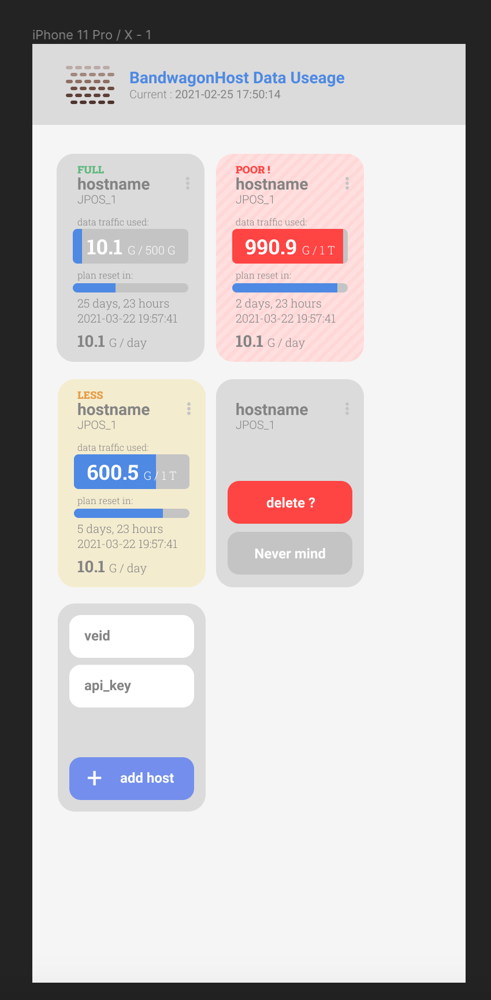

# BandwagonHostTrafficWatcher
-----------
使用免费的 Cloudflare Works 监控 BandwagonHost ( 搬瓦工 ) 主机流量使用情况。

部署时将相应网址替换成你自己的网址。

Cloudflare Workers 设置  
http://bwh.unwall.in/*  ->  http_to_https  
https://bwh.unwall.in  ->  main  
https://bwh.unwall.in/v1/*  ->  bwh_api_proxy  

感谢 [js-cookie](https://github.com/js-cookie/js-cookie), [Cloudflare](https://www.cloudflare.com/), [Figma](https://www.figma.com), [Google Font](https://fonts.google.com/).

PS. 代码很丑不规范，抛砖引玉。

